# VisaGlobal.News

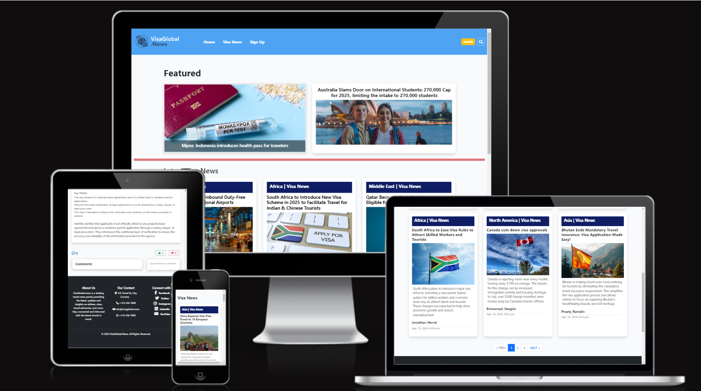

VisaGlobal.News is a full-stack web application that provides users with the latest news and updates on visas, airlines, travel advisories, and other travel-related topics. The project is built using the Django framework for the backend, with HTML, CSS, Bootstrap, and JavaScript powering the frontend.

The website serves as a reliable news portal designed to bridge the gap between travel enthusiasts and the ever-evolving world of visa regulations and global travel. The platform offers categorized articles, an efficient search function, and interactive features such as commenting, liking, and sharing articles on social media—allowing users to engage with and stay informed about important travel news.

[Link to deployed site](https://visa-global-news-3e0847e1af66.herokuapp.com/)

[Link for Admin](https://visa-global-news-3e0847e1af66.herokuapp.com/admin/login/?next=/admin/)

# Table Of Content

-   [User Experience](#user-experience)
    -   [User Stories](#user-stories)
    -   [Site Goals](#site-goals)
    -   [Scope](#scope)
-   [Design](#design)
    -   [Colour Scheme](#colour-scheme)
    -   [Database Schema](#Database-Schema)
    -   [Fonts](#Fonts)
    -   [Wireframes](#Wireframes)
    -   [Agile Methodology](#Agile-Methodology)
         -   [Overview](#overview)
         -   [EPICS(Milestones)](#epicsmilestones)
         -   [User Stories issues](#user-stories-issues)
         -   [MoSCoW prioritization](#moscow-prioritization)
         -   [GitHub Projects](#github-projects)
-   [Website Features](#features)
    -   [Navbar](#Navbar)
    -   [Footer](#Footer)
    -   [Home Page](#Home)
    -   [Visa News Page](#visa-news-page)
    -   [Sign Up Page](#sign-up-page)
    -   [Log In Page](#log-in-page)
    -   [Log Out Confirmation](#log-out-confirmation)
    -   [Error Pages](#error-pages)
-   [Future Features](#future-features)
-   [Testing](#testing)
-   [Bugs](#Bugs)
-   [Technologies And Languages](#technologies-and-languages)
    -   [Languages Used](#languages-used)
    -   [Python Modules](#python-modules)
    -   [Technologies and programs](#technologies-and-programs)
-   [Deployment](#deployment)
    -   [Before Deployment](#before-deployment)
    -   [Deployment on Heroku](#deployment-on-heroku)
-   [Credits](#credits)
    -   [Media](#media)
    -   [Code](#code)
    -   [Acknowledgements](#acknowledgements)
    -   [Comments](#comments)

## User Experience

### User Stories

1. As a first-time visitor, I want to easily navigate the website and find the latest travel-related news.
2. As a user I want the website to be responsive so I can view it on my mobile.
3. As a user, I want to be able to read articles categorized by topics such as visa, airline, or travel advisory news.
4. As a user I want to be able to register an account so that I can interact and share my opinions on articles.
5. As a registered user, I want to be able to like or dislike and comment on articles that are relevant to my interests.
6. As a registered user I want to be able to log in to my account so I can view my comments and edit, update or delete them.
7. As a registered user I want to be able to like or dislike any articles.
8. As a user, I want to read articles and the comments made on them by other users.
9. As a user, I want to see the amount of likes an article has received.
10. As a user, I want to search for specific country, visa or travel-related topics to get relevant information.
11. As a user I want to be able to see visa news article list that displays the title, the image, the excerpt, the author name and date and time of the article. 
12. As an admin, I want to manage the publication of articles, moderate user comments, and monitor overall engagement on the platform.
13. As an admin, I want to approve or disapprove comments.
14. As a non-authenticated user, I want to be prompted to register when accessing the website's interacive functionalities that are available to registered users only.
15. As user, I want to browse articles through pagination.

### Site Goals
The main goal of VisaGlobal.News is to provide a reliable and up-to-date source of travel news and visa regulations. This includes:

1. Offering categorized articles for a diverse range of travel-related topics.
2. Facilitating user interaction through features such as likes, comments, and social media sharing.
3. Implementing a powerful search functionality that allows users to quickly locate relevant articles.
4. Ensuring that the website is mobile-friendly and easily accessible on all devices.

## Design
### Colour Scheme
The website features a calming and professional color palette that combines shades of blue, violet, and green with complementary neutrals.  
Overall, this color scheme creates a professional and user-friendly environment, with subtle variations in hue and transparency to guide users' attention and enhance the visual appeal of the website.

### Database Schema

#### Models
1. Allauth User Model

The User model is part of Django Allauth. The model comes with predefined fields as standard. Some of them are username, email, name, password, and more. This model is used for user authentication, hence why changes directly to this model are not advisory. The User model is connected to the Profile model with one to one relationship. 

2. visa_app(Home Page) Model

The Profile model is a custom custom-created model to handle the user profile details. Signals are used to reflect the changes between the User and Profile models. For example, if the Profile gets updated or deleted the changes will apply to the user model as well. 

3. Visanews Model

The listing model is connected to the Profile with a ForeignKey field - owner. It is furthermore connected to the CarMake and CarModel models via ForeignKey field again

### Fonts
The font used in this project is Roboto Slab, which compliments the design of the website.  

### Wireframes
- Home Page
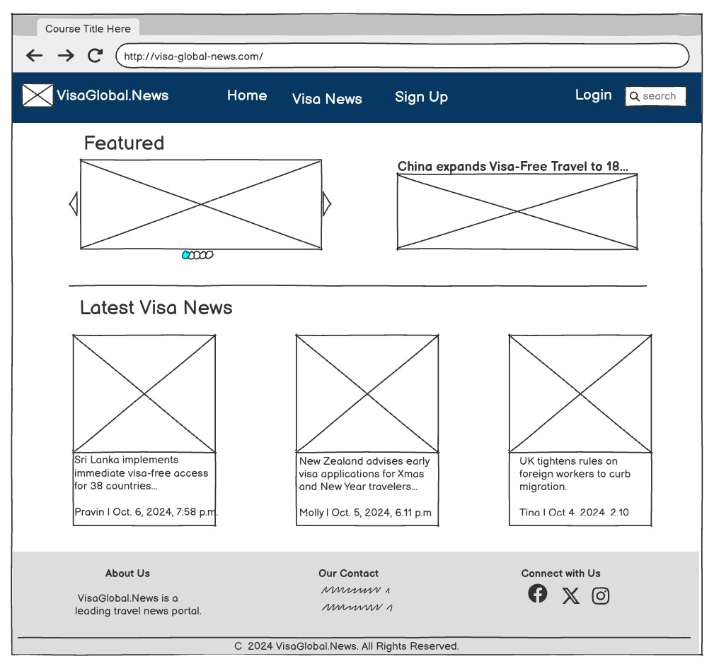

- 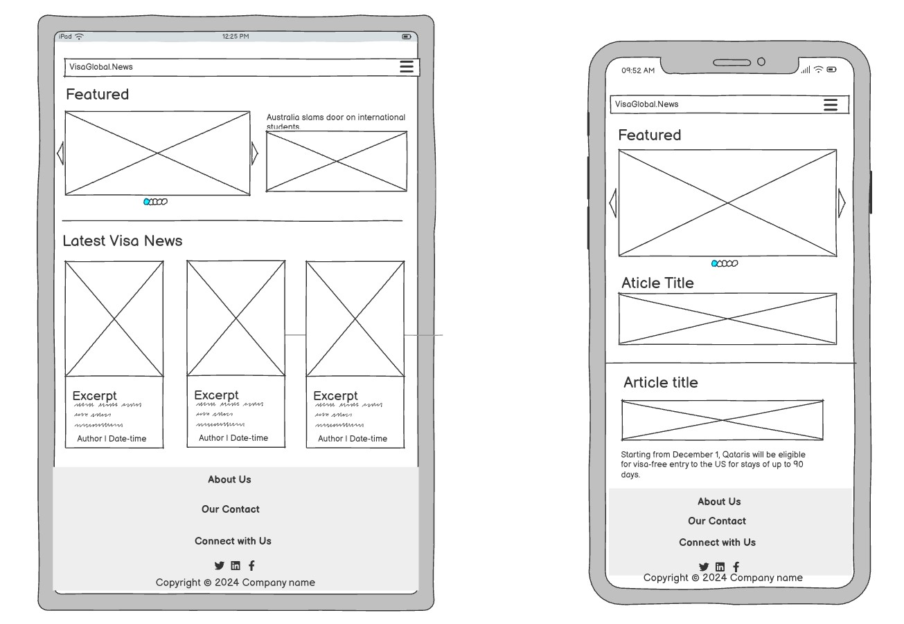

- Visa News Page

- Article_Detail Page
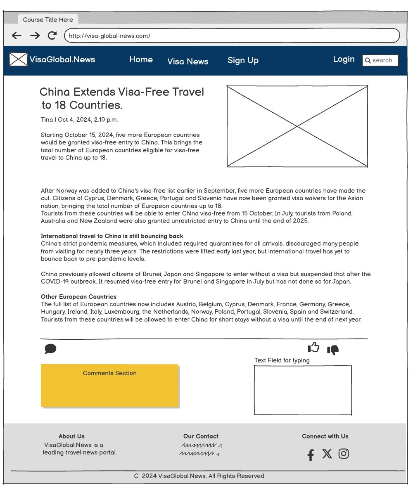

- Sign Up Page
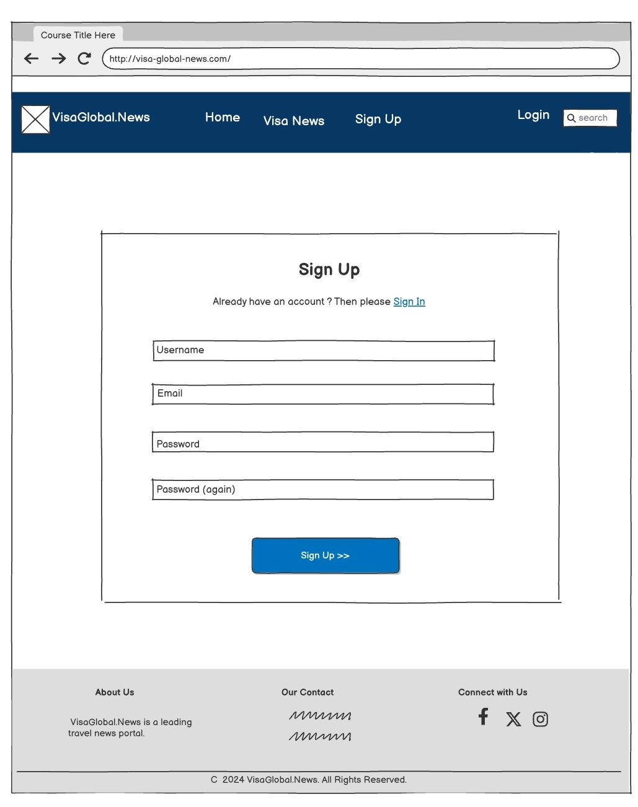

### Agile Methodology
#### Overview
I created my project using agile principles which presented a significant learning curve, especially as it was my first experience developing a full-stack application. The Agile approach provided structure and flexibility, allowing me to plan and prioritize the website's features through detailed user stories. Each story had well-defined acceptance criterias, which ensured that the requirements for each feature were clearly understood and met during development. This method helped streamline the process and maintain focus on delivering functional and user-friendly features.

It is worth-mentioning that during the development of my project, I adjusted my user stories and acceptance criterias to prioritize the 'must-have' requirements. Initially, I had also planned to implement additional features like a "forgot password" option, "popular posts," and a "subscribe to newsletter" functionality. However, as I faced numerous errors while trying to incorporate these features, I decided to leave them out to focus on completing the core functionality without significant delays.

#### EPICS(Milestones)
The user stories are organized into eight EPICS or Milestones. Additionally, a Milestone named "Project Backlog" was created to track any extra features, bugs, or uncompleted tasks that emerged during the development process.  
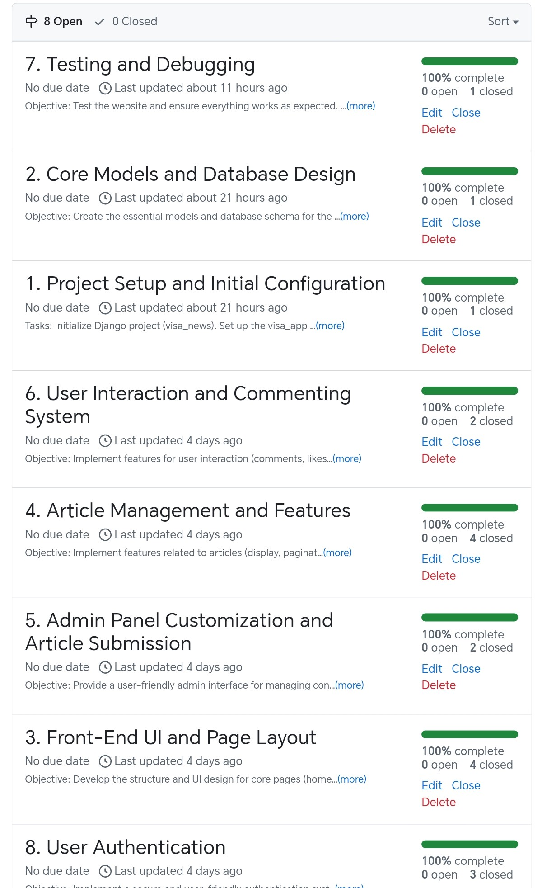

#### User Stories issues
The structure of each user story issue consists of the user story itself, followed by acceptance criteria that define the specific requirements that must be met for the feature to be considered complete. These criteria serve as a clear guideline for testing and validating the functionality of the feature, ensuring it aligns with the user's needs and expectations.  
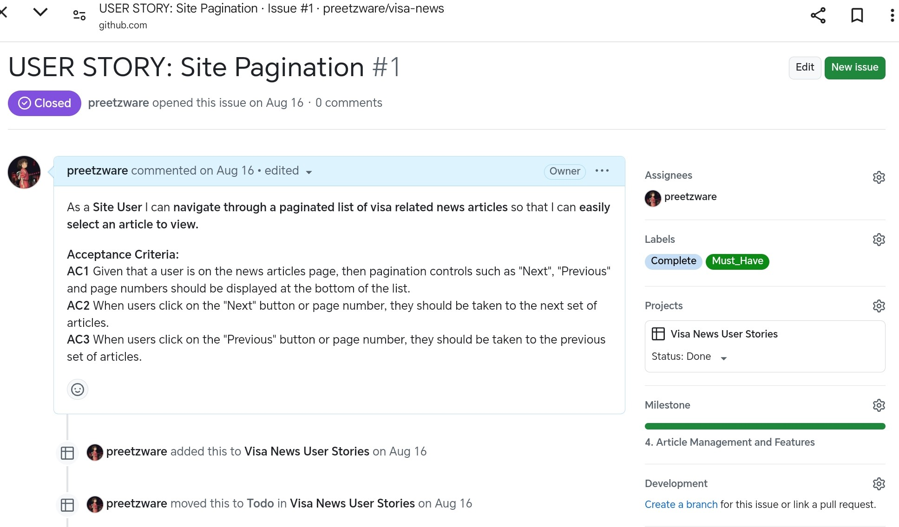

#### MoSCoW prioritization
The MoSCoW prioritization technique was employed to efficiently rank the project’s features and requirements based on their significance. "MoSCoW" stands for "Must have, Should have, Could have, and Won't have," with each category helping to organize and prioritize features. This approach guided the development process, ensuring that the most essential elements were addressed first.  
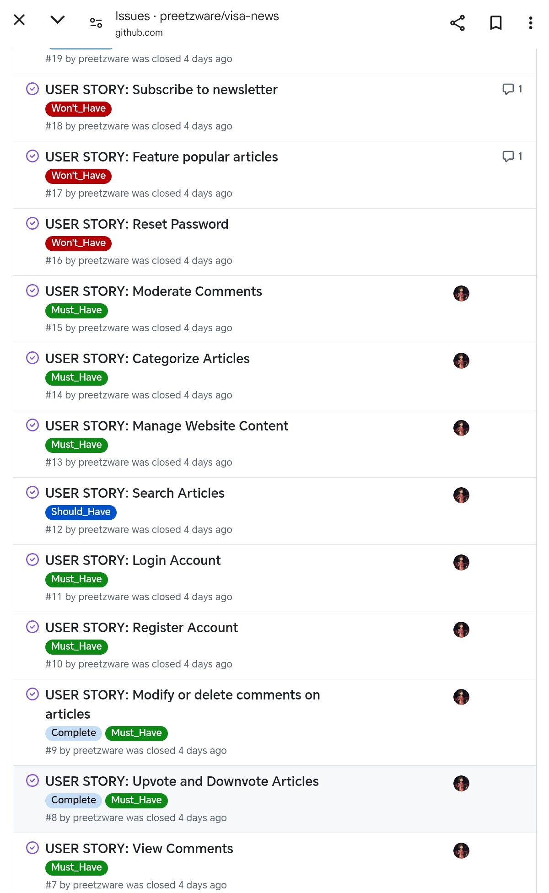

#### GitHub Projects
For the development of the project, I made use of a simple Kanban Board structure, organized into columns like To Do, In Progress, Done, and Backlog. This layout offered a clear, efficient way to track task progress while helping to visualize and manage the workflow effectively.  
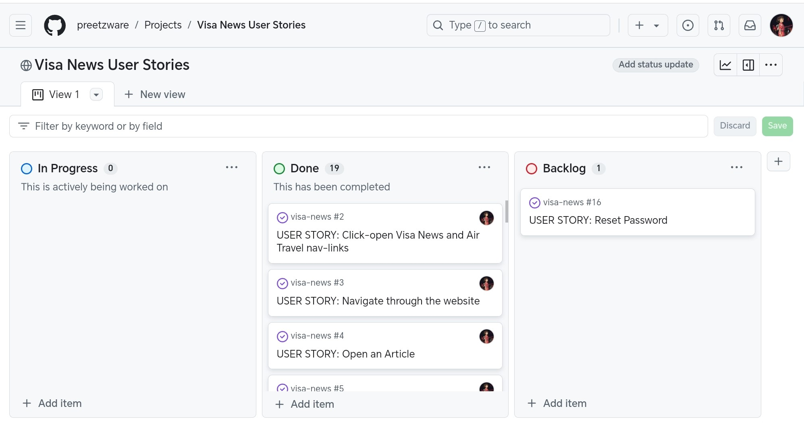

## Features
### Navbar
The navbar, a consistent feature across all pages, was built using Bootstrap with custom modifications to ensure full responsiveness. The VisaGlobal.News logo, created via [logodesign.ai website](https://www.logodesign.ai), is positioned on the left and functions as a link to the homepage. On the right, there are navigation links that allow users to move easily throughout the website. If a user is not authenticated, the links displayed include Home, Visanews, Signup, Login and the search icon. The search icon reveals a search bar and a "Go" button when clicked, enabling users to search for articles on both the Homepage and Visa News page. The search view has been designed using metrics such as article titles, excerpts, and categories to enable users to efficiently find relevant articles. By leveraging these key elements, users can quickly identify content that meets their interests, enhancing their overall experience on the platform.

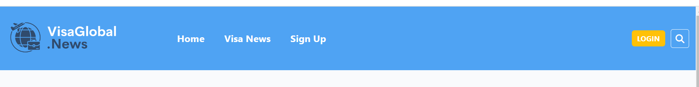

 If the user is authenticated, they will see navigation links for Home, Visa News, Log Out, along with a personalized greeting, "Hi (username), you're logged in!" and the search icon. To enhance user experience, the active navigation link is underlined with a border, providing a visual cue to indicate the page the user is currently viewing.

 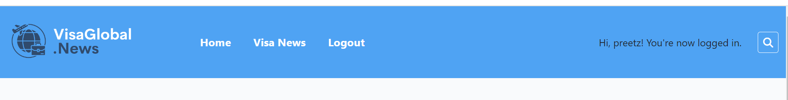

 ### Footer
 The footer is divided into three sections: **About**, which provides an introduction to VisaGlobal.News; **Our Contact**, which presents the contact details; and **Connect with Us**, which features social media icons and links that allow users to connect with VisaGlobal.News by opening the links in a new tab.

 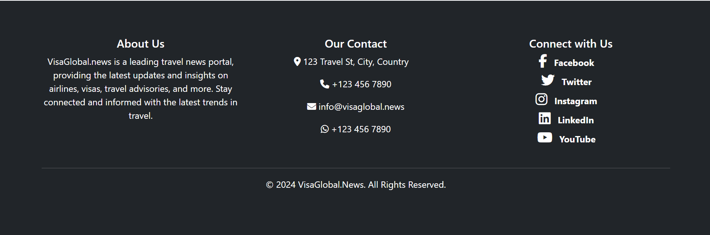

### Home
#### Carousel Section
This section has been incorporated into the homepage to showcase the three most recent news articles, providing users with quick access to the latest updates. Additionally, a fourth story is positioned adjacent to the carousel, ensuring that visitors can easily discover important content at a glance.

 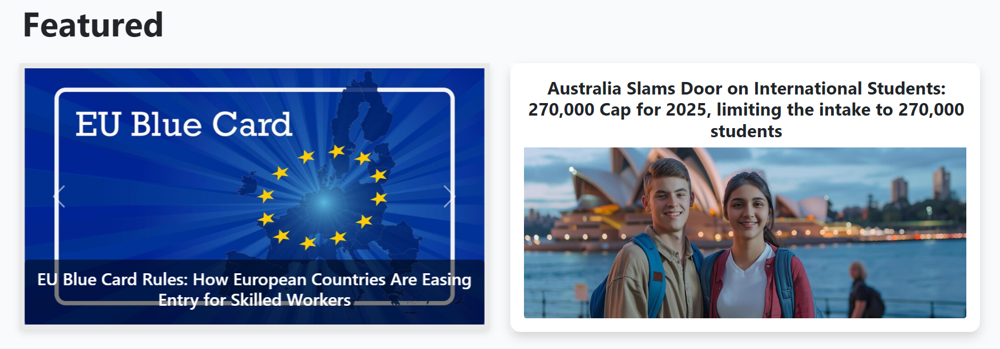

### Visa News Page

### Article_detail Page

#### Flash Messages
Flash messages have been utilized to provide feedback to users whenever they perform CRUD operations, as well as during the sign-in and sign-out processes. These messages help inform users about the success or failure of their actions, enhancing the overall user experience.

#### Unauthenticated User Prompted

### Login page
Consist of a form with username and password. 

### Sign Up page
The sign-up process features a form that includes fields for the user's email, username, password, and password confirmation. There is also a link for users who already have an account to log in. At the bottom of the form, a sign-up button allows users to submit their information. Once signed up, users are automatically logged in and redirected to the homepage.

### Sign out confirmation
When the user clicks the logout link in the navigation bar, a modal with a warning message pops up. It also features two buttons: one to close the modal and stay on the actual page and another to proceed with logging out.

### Edit Comment
The edit profie page renders a form with prefilled fields with the existing information for this user. It consists of profie image, name, username, email, phone, town, county and about me section. Below that is the submit button which will update the profile details once submitted. 

### Delete Comment Confirmation
This page consists of warning message with two buttons - one to go back and one to delete the profile. Delete profile is in red to indicate danger. Once clicked the profile is deleted and the user is redirected to We are sorry to see you go page

### Error Pages
- 404
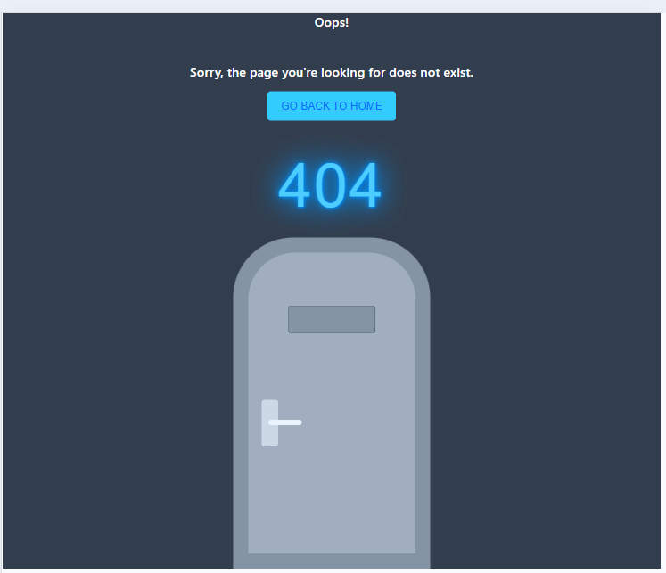

- 403

- 500

## Future Features
1. User Profiles and Personalization:

Implement user profiles where users can save their favorite articles, set preferences for topics, and receive personalized content recommendations based on their reading history and interests. This could also include a dashboard that shows users their reading activity, liked articles, and comments.

2. Newsletter Subscription:

Add a newsletter subscription feature that allows users to sign up for regular updates about the latest articles, travel advisories, and visa regulations. This feature could include customizable options for users to choose the frequency and types of updates they wish to receive.

3. Multilingual Support:

Incorporate multilingual support to make the website accessible to a wider audience. This feature would allow users to select their preferred language for content, making the site more inclusive and user-friendly for non-English speakers.

## Testing
Testing documentation can be found [here.](TESTING.md)

## Bugs
**Known Bugs**

1. **URL conflict issues**  
   During the development process of my project, I experienced a bug with a URL conflict, and you had to update the urlpattern in visa_app/urls.py to resolve it.  `django-admin-interface` package, I encountered duplicate JavaScript files, which led to unexpected behaviors in the admin panel. This required careful file management to remove duplicates and ensure only the necessary scripts were loaded.

2. **Styles Not Connecting to Login/Signup Pages**  
   I faced issues where the styles were not properly connecting to the login and signup pages. The root cause was a misnamed directory; I had renamed the default `account` directory to `accounts` in an attempt to improve syntax. This also required reverting changes in `urls.py` to restore proper functionality.

3. **Static Files Issues with .gitignore**  
   While working on static files, I accidentally added critical files to `.gitignore`, which caused them to be excluded from commits. This mistake led to untidy and incomplete commits. After reverting these changes, I had to clean up the commit history to maintain a professional repository.

4. **Heroku Deployment Forms Bug**  
   A bug arose during Heroku deployment where forms were not rendering correctly. Clearing the cache resolved this issue.

5. **Styles not reflecting on deployed website**  
   A few times I had this issue where I applied some styles that would not reflect on the deployed website. After debugging, I realized it was due to not running `collectstatic` in the terminal to collect the latest CSS changes. After making CSS changes and running this command, this issue was completely resolved.

6. **Like and Dislike Buttons not Functioning**  
   At one point, stylesheet changes were not appearing even after refreshing the page. The solution was setting `DEBUG = True`, which allowed the changes to be reloaded correctly.

7. **Mixed Content warning for Cloudinary Images**  
   During development, Meta's restrictions blocked VPN access to Threads in the EU, which impacted testing and deployment workflows involving social media integrations. I did not include Threads in the social media links.

8. **Log Out of Admin Account When Testing Locally**  
   A lesson learned was to always log out of the admin account when testing on localhost. Remaining logged in as an admin affected the behavior of allauth forms, leading to misleading results. The fix for this to log in using a different browser./

9. **Server Error 500 on New Account Creation**  
   Users encountered a server error (500) when attempting to create a new account. This required debugging to identify issues within the account creation logic and ensure smooth user onboarding.

10. **Race Booking Event Model**  
   Initially, I wanted to implement a separate login setup for race entrants who are not club members to prevent them from accessing the members' area. This required setting up a completely different account system. However, due to time constraints and project requirements, I decided to abandon this model. In practice, the club uses an external service provider for event registration and payment, which alleviates the need for this feature.

---

## Technologies And Languages
### Languages Used
- HTML
- CSS
- JavaScript
- Bootstrap
- Python
- Django

### Python Modules

- gunicorn - Gunicorn is a popular WSGI (Web Server Gateway Interface) HTTP server for running Python web applications, including Django applications, in a production environment.

- psycopg2 - Psycopg2 is a PostgreSQL adapter for Python. It allows Django to connect to PostgreSQL databases.

- whitenoise - Whitenoise is a middleware for serving static files directly from your Django application.

### Technologies and programs
 - [Favicon Generator](https://www.favicon.io/) was used to generate Favicon
 - [GitHub](https://github.com/) is the hosting site used to store the code for the website.
- [Code Institute Template](https://github.com/Code-Institute-Org/gitpod-full-template) was used as a starting point for the project.
- [Google Fonts](https://fonts.google.com/) was used to import fonts.
- [Google Chrome Lighthouse](https://developers.google.com/web/tools/lighthouse) was used during the testing of the website.
- [Google Chrome Developer Tools](https://developer.chrome.com/docs/devtools/overview/) was used during testing, debugging and making the website responsive.
- [W3C HTML Validator](https://validator.w3.org/) was used to check for errors in the HTML code.
- [W3C CSS Validator](https://jigsaw.w3.org/css-validator/) was used to check for errors in the CSS code
- [Js Hint](https://jshint.com/) was used to validate the JavaScript code.
- [CI Python Linter](https://pep8ci.herokuapp.com/) was used to validate the Python code.
- [Image Convert](https://tinypng.com/) used to convert images to webp format
- [Coolors.co](https://coolors.co/) was used to display the colour scheme.
- [Logo Design](https://www.logodesign.ai) was used to create the website's logo.
- [Wireframes](https://balsamiq.com/) was used to create the website's wireframes.
- [Debugging] - (https://www.chatgpt.com) was used for troubleshooting and debugging.

## Deployment
### Before Deployment
To ensure the application is correctly deployed on Heroku, it is essential to update the requirements.txt file. This file contains a list of dependencies that the application requires to operate.

- To generate the list of requirements, use the command pip3 freeze > requirements.txt. This will update the file with the necessary dependencies.
- After that, commit and push the changes to GitHub.

**Important:** Before pushing code to GitHub, make sure that all sensitive credentials are stored in an env.py file, which should be included in the .gitignore file. This instructs Git not to track the file, preventing it from being uploaded to GitHub and exposing your credentials.

### Deployment on Heroku
- To deploy the project on Heroku, you must first create an account.
- Once logged in, create a new app by clicking the "Create App" button.
- Choose a unique name for your app, select a region, and then click "Create App."
- On the following page, navigate to the "Settings" tab and scroll down to the "Config Vars" section. Any sensitive files, such as credentials and API keys, should be added here. For this project, the following credentials need to be secured:
1. Django's secret key
2. Database credentials
3. AWS access key
4. AWS secret key

- Scroll down to the "Buildpacks" section. The buildpacks will install additional dependencies that are not included in the requirements.txt. For this project, you need the Python buildpack.
- From the tabs above, select the "Deploy" section.
- The deployment method for this project is GitHub. After selecting it, confirm the connection to GitHub, search for your repository name, and click "Connect" to link your Heroku app with your GitHub code.
- Scroll down to the deploy section where you can enable automatic deploys, meaning the app will update every time you push code to GitHub. Click "Deploy" and wait for the app to build. Once completed, a message should appear indicating that the app has been successfully deployed, along with a button to view the app.

## Credits
- [Travelobiz Website](https://travelobiz.com/)
- [Visaguide.News](https://visaguide.world/news/)
- [Stack Overflow](https://stackoverflow.com/)
- [Django documentation](https://docs.djangoproject.com/en/5.1/)
- [OpenAI's ChatGPT](https://chatgpt.com/)
- [Freepik](https://www.freepik.com/)

### Acknowledgements
- I would like to give special credit to Code Institute's "I Think Therefore I Blog" Django walkthrough project. The knowledge and guidance from this walkthrough were instrumental in helping me understand and implement the concepts needed to bring my VisaGlobal.News project to life.
- A heartfelt thank you to my cohort facilitators, Amy and Lewis, for their unwavering support and guidance throughout this journey.
- I am grateful to my mentor, Harry Dhillon, for his valuable feedback and insightful guidance while reviewing my project.
- A special mention goes to my friend, Brian McConway, for his advice and encouragement during the development process.
- Lastly, I want to express my deep appreciation to my husband and toddler for their support, which allowed me to dedicate the necessary time to complete this project while maintaining a healthy balance.

### Comments
This project consists of two primary apps: the homepage and the Visa News page. Both apps manage user interactions, such as commenting, liking, disliking, and searching for articles. They also handle the full range of CRUD functionalities, allowing users to add, delete, and interact with comments on articles, including the ability to like or dislike articles as well.
In addition, Users have the option to share articles via different social media platforms using the icons provided below the article excerpts, allowing for easy content sharing.

Besides, the search feature enables users to retrieve articles from both pages, regardless of which page they initiate the search from, ensuring a seamless user experience.

Although I had planned to include automated testing, I ran out of time during development. This is a feature I aim to implement in the future, as it will help me maintain the project more efficiently and confidently as I continue to add more functionality.