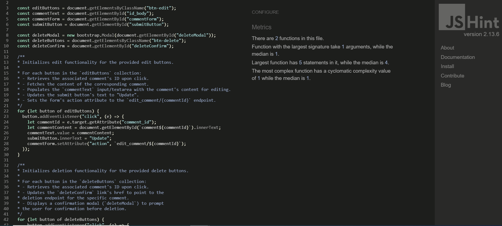
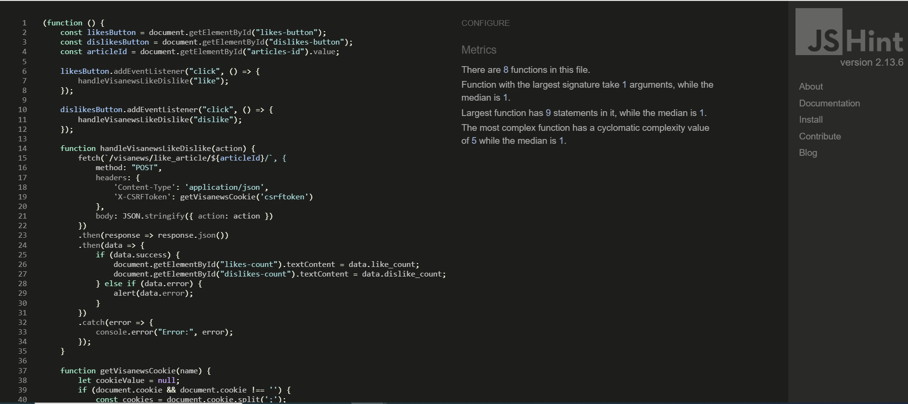
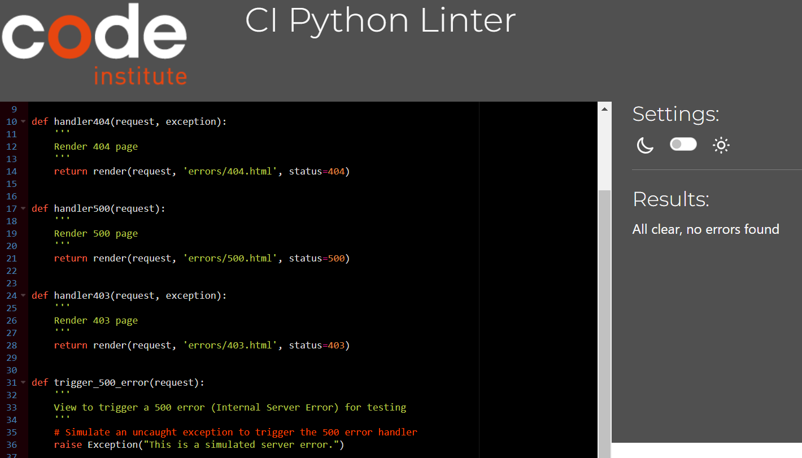

# Testing
- [Code Validation](#code-validation)
    - [HTML](#html)
    - [CSS](#css)
    - [JavaScript](#JavaScript)
    - [Python](#python)
- [Lighthouse](#Lighthouse)
- [Manual Testing](#manual-testing)
- [Responsiveness](#Responsiveness)
- [Browser Compatibility](#browser-compatibility)

## Code Validation
### HTML
|Page|Validator|Result|
| --- | --- | --- |
| Home Page | | <mark>PASS<mark> |
| Visa News Page | | <mark>PASS<mark> |
| Sign Up Page | | <mark>PASS<mark> |
| Log In | | <mark>PASS<mark> |
| Error pages | | <mark>PASS<mark> |

### CSS
Test Results CSS  <mark>PASS<mark> 

### JavaScript
1. like_dislike.js from home page articles <mark>PASS<mark> 

2. comments.js from home page articles <mark>PASS<mark>

3. visanews_like_dislike.js from Visa News page articles <mark>PASS<mark>

4. visanews_comments.js from Visa News page articles <mark>PASS<mark>

### Python
1. visa_app (Home page)

- models.py <mark>PASS<mark>

- urls.py <mark>PASS<mark>

- views.py <mark>PASS<mark>

- admin.py <mark>PASS<mark>

- forms.py <mark>PASS<mark>

2. visa_news app (project app)
- settings.py <mark>PASS<mark> 

- urls.py <mark>PASS<mark>

- views.py <mark>PASS<mark>

3. visanews app
- admin.py <mark>PASS<mark>

- models <mark>PASS<mark>

- views.py <mark>PASS<mark>

- urls.py <mark>PASS<mark>

- forms.py <mark>PASS<mark>

## Lighthouse

|Lighthouse|Validator|Result|
| --- | --- | --- |
| Home Desktop | | <mark>PASS<mark> |
| Home Mobile | | <mark>PASS<mark> |

## Manual Testing 

|Section|Test Action|Expected Result|Pass/Fail|Comments|
| ---| ---| ---| ---| ---|
| **HOME PAGE** |
|Navbar|Click on VisaGlobal.News logo |Redirect to Home Page |Pass| |
||Click on Home link in Navbar|Redirect to Home |Pass| |
||Click on Visa News link in Navbar|Redirect to Visa News Page |Pass| |
||Click on Sign Up link in Navbar|Redirect to Sign Up Page |Pass| |
||Click on Login Button in Navbar|Redirect to Login Page |Pass| |
||Click on Log Out link in Navbar|Redirect to Home Page |Pass| |
||Click on Search Icon in Navbar|Collapsible search bar and 'Go' button display and are functional |Pass| |
|Carousel section|Click on all featured articles' image and title.|Link opens to views article |Pass| |
|Article Cards in homepage |Click on all article card's category, title, image and excerpts|Link to article opens in new page |Pass| |
| **VISA NEWS** |
|Article Cards in Visa News page  | Click on all article card's category, title, image and excerpts |Link to article opens in new page |Pass| |
|Pagination | Click on pagination buttons | Paginated page opens and article cards load | Pass| |
| **ARTICLE PAGE** |
|Social Media share links | Click on social media share icons | All icons links open in a new tab |Pass| |
|Like/Dislike Button| Click on Like or Dislike Button| Either will increase the number of either likes or dislikes per user |Pass| |
|Comments Section | Type comment in comment box and click on Submit button | Flash message notification displays and pending comment is displayed with Edit and Delete buttons functionality working |Pass| |
|Edit Button |Click on the edit button | Text appears in comments textbox to enable editing and re-submitting |Pass| |
|Delete Button | Click on Delete button | Alert message appears to confirm Deletion or to Close window |Pass| |
|Comment Counts |Pending comment is approved by admin |Comment and comment count both display and can be viewed by logged in users  |Pass| |
| **FOOTER** |
|Contact section| Click on address link |Link opens in a new tab |Pass| |
|Connect With Us| Click on every social media link |Links open in respective new tab |Pass| |
| **SIGN UP** |
|Form Fields | Fill all fields with correct data in the expected format and click on Sign In.| User is redirected to the home page and 'Hi (Username), You're now logged in!' message appears in navbar|Pass| |
| **LOGIN** |
|Form Fields| Fill all fields with correct data in the expected format and click on Sign In. |Flash message appears, user is redirected to the home page and 'Hi (Username), You're now logged in!'message appears in navbar|Pass| |
| **LOG OUT** |
|Log Out Button| Click on log out button in navbar | Alert message appears confirming logout or close window.Flash message appears after logged out. |Pass| |
| **SEARCH BAR** |
|Search for Articles|Click on Search icon, type in words and hit GO button |If typed words match category, title and excerpts from articles found in both pages, results will display |Pass|Displays results from both pages - Visa Articles and Visa News Articles|

## Responsiveness
Each page from the project has been tested using dev tools in Google Chrome. Further testing was done on laptop, tablet and mobile to confirm all is working as expected.

|Device|Screen Size|Pass/Fail|Comment|
| --- | --- | --- | ---|
| Iphone 14 | 320x480 | PASS | All sections are displayed correctly. All features work|
| Ipad Pro 12.9 | 280.6 x 214.9 | PASS | All sections are displayed correctly. All features work|
| HP Probook | 1366 x 768| PASS | All sections are displayed correctly. All features work|
| Macbook Pro 13" | 349×240×15| PASS | All sections are displayed correctly. All features work|

## Browser Compatibility

|Browser|Result|Pass/Fail|Notes|
| --- | --- | --- | ---|
| Google Chrome | All pages, load as expected. All features work as expected | PASS | --- |
| Internet Explorer | All pages, load as expected. All features work as expected | PASS | --- |
| Edge | All pages, load as expected. All features work as expected | PASS |

